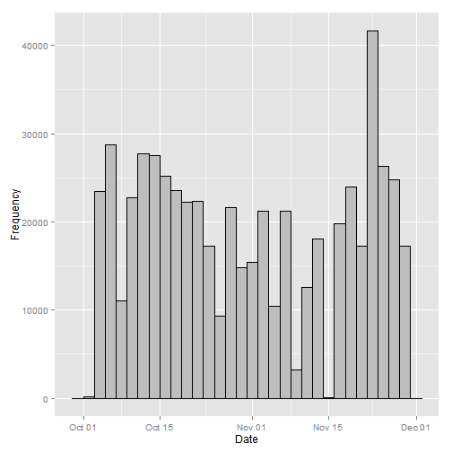
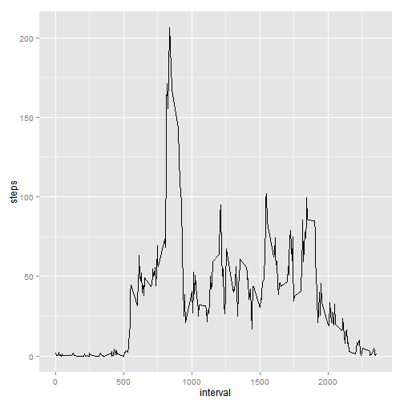
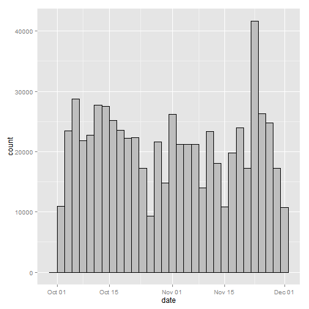
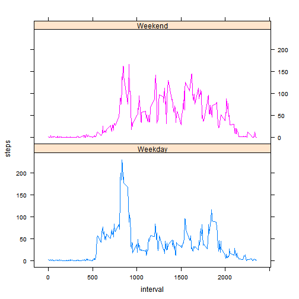

# Reproducible Research: Peer Assessment 1

This assignment makes use of data from a personal activity monitoring device. This device collects data at 5 minute intervals through out the day. The data consists of two months of data from an anonymous individual collected during the months of October and November, 2012 and include the number of steps taken in 5 minute intervals each day.

The variables included in this dataset are:

* steps: Number of steps taking in a 5-minute interval (missing values are coded as NA)

* date: The date on which the measurement was taken in YYYY-MM-DD format

* interval: Identifier for the 5-minute interval in which measurement was taken

The dataset is stored in a comma-separated-value (CSV) file and there are a total of 17,568 observations in this dataset.

## Loading and preprocessing the data

1. Open the ```zip``` file and extract the ```csv``` file. (Assuming file is in current working directory)
2. Create a data frame from the ```csv``` file.
3. The converstion of interval column to factor type is carried out and data column converted to Date type.
4. Summary and str methods are used to understand the data.


```r
# unzip data
unzip("activity.zip")

# read the data
activity <- read.csv("./activity.csv")

# correctly format date
activity$date <- as.Date(activity$date)

# show summary of the data
summary(activity)
```

```
##      steps            date               interval   
##  Min.   :  0.0   Min.   :2012-10-01   Min.   :   0  
##  1st Qu.:  0.0   1st Qu.:2012-10-16   1st Qu.: 589  
##  Median :  0.0   Median :2012-10-31   Median :1178  
##  Mean   : 37.4   Mean   :2012-10-31   Mean   :1178  
##  3rd Qu.: 12.0   3rd Qu.:2012-11-15   3rd Qu.:1766  
##  Max.   :806.0   Max.   :2012-11-30   Max.   :2355  
##  NA's   :2304
```

```r
# show structure of the data 
str(activity)
```

```
## 'data.frame':	17568 obs. of  3 variables:
##  $ steps   : int  NA NA NA NA NA NA NA NA NA NA ...
##  $ date    : Date, format: "2012-10-01" "2012-10-01" ...
##  $ interval: int  0 5 10 15 20 25 30 35 40 45 ...
```


## What is mean total number of steps taken per day?

A histogram showing the total number of steps taken each day is shown below.


```r
library(ggplot2)
```

```
## Warning: package 'ggplot2' was built under R version 3.1.1
```

```r
# generate the plot
q <- qplot(date, weight=activity$steps, data=activity,  
         geom="histogram", xlab = "Date", ylab = "Frequency") + 
        geom_histogram(colour="black", fill="grey")

# print plot
print(q)
```

```
## stat_bin: binwidth defaulted to range/30. Use 'binwidth = x' to adjust this.
## stat_bin: binwidth defaulted to range/30. Use 'binwidth = x' to adjust this.
```

 

Calculation of the mean and median total number of steps taken per day:


```r
# mean steps per day
mean(tapply(activity$steps, activity$date, sum, na.rm = TRUE))
```

```
## [1] 9354
```

```r
# median steps per day
median(tapply(activity$steps, activity$date, sum, na.rm = TRUE))
```

```
## [1] 10395
```

## What is the average daily activity pattern?

A plot of the 5-minute interval and the average number of steps taken (averaged across all daya):


```r
# segment average steps
average_steps <- data.frame(cbind(activity$interval, tapply(activity$steps, activity$interval, mean, na.rm = TRUE)))

# give column names
colnames(average_steps) <- c("interval", "steps")

# generate plot
q <- ggplot(data = average_steps, aes(x=interval, y=steps)) +
  geom_line()

print(q)
```

 

The interval which contains the maximum number of steps across all the days is:


```r
# find maximum time
maxtime <- average_steps[which.max(average_steps$steps), "interval"]

# pretty print the time
strftime(as.POSIXct(Sys.Date()) + 
             as.difftime(round(maxtime/100), units="hours") + 
             as.difftime(maxtime%%100, units="mins"), "%r", tz = "UTC") 
```

```
## [1] "08:35:00 AM"
```

## Imputing missing values

The total number of missing values in the dataset:


```r
# total NA's
sum(is.na(activity$steps))
```

```
## [1] 2304
```

Using the mean for 5-minute interval, to replace the missing values.


```r
# copy
fixed <- activity

# replace NA's
fixed[is.na(fixed[, 1]), 1] <- average_steps[is.na(fixed[, 1]) ,2]
```

Histogram of the new dataset with the NAs replaced with the 5-minute means.


```r
# plot
qplot(date, weight = fixed$steps, data=fixed, geom = "histogram") +
    geom_histogram(colour="black", fill="grey")
```

```
## stat_bin: binwidth defaulted to range/30. Use 'binwidth = x' to adjust this.
## stat_bin: binwidth defaulted to range/30. Use 'binwidth = x' to adjust this.
```

 

The new mean and median values differ from the initial values, and have higher value. 
(Most days have an increased number of mean of steps)


```r
# calculate mean
mean(tapply(fixed$steps, fixed$date, sum, na.rm = TRUE))
```

```
## [1] 10766
```

```r
# calculate median
median(tapply(fixed$steps, fixed$date, sum, na.rm = TRUE))
```

```
## [1] 10766
```

## Are there differences in activity patterns between weekdays and weekends?


```r
library(lattice)

# factor out patterns
fixed$day <- as.factor(ifelse(weekdays(fixed$date) %in% c("Saturday", "Sunday"), "Weekend", "Weekday"))
```

Plot the 5-minute average of steps, by weekday/weekend.


```r
# plot patterns
xyplot(steps ~ interval | day, aggregate(steps ~ interval + day, fixed, FUN = mean), layout = c(1, 2), type = "l", group=day)
```

 
